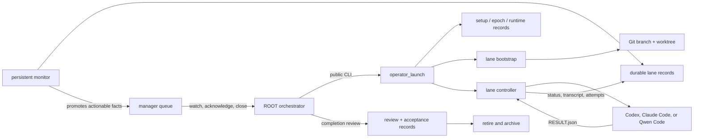

# Current `harness-single` review

Reviewed branch: `working/firmware/v2-candidate`  
Reviewed commit: `a5ba87314562c71e30232d0f43782313fb5c027b`  
Review date: 2026-09-19

Scope: tracked product content at the reviewed commit. The pre-existing untracked
`harness-single/w/` worktree material is not part of that commit and was excluded.

## Review judgment

**REVIEW: REVISE documentation; the accepted Windows runtime is ready to use.**

I found no new runtime defect in this review. The implementation at the reviewed commit has an
accepted Windows native evidence set: 29 required claims are `PROVED`, none are `INCOMPLETE` or
`FAILED`, the focused product checks passed, cleanup was proved, and an independent reviewer
approved the final correction. The remaining accepted platform gap is native macOS/Linux host
execution.

Three documentation and packaging details should be corrected before treating every shipped
document as authoritative:

1. **The specification understates current provider support.**
   [`orchestrator_harness/SPEC.md`](harness-single/orchestrator_harness/SPEC.md) lines 17-18 say
   that only Codex is implemented and future providers are fixtures. The registered adapters,
   public documentation, tests, and native acceptance evidence all cover Codex, Claude Code, and
   Qwen Code. This is stale specification text. The smallest correction is to describe all three
   shipped adapters, or label that S4 passage as historical.
2. **The final overview describes resume incorrectly.**
   [`final_v2-harness_overview.md`](harness-single/final_v2-harness_overview.md) line 21 says a lane
   resumes with a replacement provider session. The implementation requires the saved native
   session ID and fails with `NO_SAVED_SESSION_ID` when it is absent
   ([`resume.py`](harness-single/orchestrator_harness/resume.py), lines 228-244). Resume creates a
   fresh harness `run_id` in the same worktree and continues the same provider session. The
   overview should say that directly.
3. **The portable checkout contains a machine-specific active configuration.**
   [`harness-config.json`](harness-single/harness-config.json) is tracked and names an absolute
   workspace on the build machine. This is usable in the current checkout, and the quick start
   correctly tells a new operator to replace it, but a copied checkout is not configured until
   that edit is made. The root README also says local configuration belongs under `local-config/`
   even though `find_harness_root()` and `load_config()` require `harness-config.json` at the
   harness root. The product should either ship a clearly named example and ignore the active
   file, or clarify that this one root-level file is the exception.

These are onboarding and contract-description issues. They do not contradict the accepted Windows
runtime behavior at the reviewed commit.

## What this harness is

The harness is a durable execution and coordination boundary for coding agents working in Git
branches and worktrees. A persistent ROOT orchestrator decides what work exists and which provider
will do it. The harness prepares isolated lanes, starts one provider worker per lane, records
events and process identities, serializes declared non-Git resources, validates the worker's result,
and records ROOT's review and acceptance.

It is deliberately not a planner or autonomous scheduler. It does not create a dependency graph,
choose tests, decide whether work is correct, merge branches, promote a release, or repair failed
work. Those decisions remain with ROOT.



The most important design choice is the separation of **execution facts** from **management
decisions**. A worker can report a structurally valid result, but that does not accept the work.
ROOT separately writes a review and an acceptance decision.

## Main components

| Component | Responsibility |
|---|---|
| `operator_launch` | The sole public CLI. Every command returns `{ok, code, summary, evidence_paths, next_action}` and has a stable process exit status. |
| Setup | Validates the closed configuration and resource manifest, verifies the adapter catalog, stages the active super-cache, installs ROOT hooks and skills, creates runtime directories, and starts the monitor. It does not start a lane. |
| Bootstrap | Creates a branch/worktree lane, stages provider-neutral and selected-provider worker material, writes the task, result template, binding, invocation, and lane record. It does not start the provider or acquire a lease. |
| Lane controller | Acquires declared resources, starts the provider through its adapter, captures session/transcript/attempt evidence, validates `RESULT.json`, requests bounded corrections, and proves process cleanup before releasing resources. |
| Persistent monitor | Reconciles lane and process state, promotes actionable conditions and worker escalations into the manager queue, and records a heartbeat. It reports facts; it does not decide or repair. |
| Manager queue | Carries ROOT-facing events through `PENDING -> ACKNOWLEDGED -> COMPLETE | BLOCKED`, with durable delivery history and deduplication. |
| Lane inbox | Carries ROOT assignments to one managed worker through the same explicit state progression. It is separate from the manager queue. |
| Provider adapters | Build native CLI arguments, continue saved sessions, parse provider output, capture session IDs, and classify non-retryable startup/auth/process failures. |
| Review and retirement | Writes linked review/acceptance records, then archives evidence and removes an accepted lane only after cleanup proofs succeed. |
| Release-check selector | Owns stable check IDs and selects fast, affected, full, or release checks. It reuses passing credit only when inputs and Git identity still match. |
| Optional watcher | Tails bounded diagnostic inputs. In the required default mode, `evaluator_enabled: false`, it does not invoke a model or control the run. |

## The normal lifecycle

1. **Configure.** Write the root-level `harness-config.json` with an absolute ROOT workspace and
   select managed or plain coordination. Declare every external exclusive resource in
   `resource-manifest.json`.
2. **Set up.** `harness setup` validates all inputs before writing, installs the selected runtime
   material, and starts the persistent monitor. Re-running setup is idempotent; `--overwrite`
   explicitly re-integrates installed material.
3. **Bootstrap a lane.** ROOT provides a `project-task-card/v1`, lane ID, provider, model, base
   commit/branch information, and any declared exclusive resource IDs. The harness creates the
   worktree and durable lane identity.
4. **Launch.** The public launcher starts a detached controller and waits for a bounded startup
   handshake. The controller starts exactly one provider process boundary.
5. **Work and communicate.** In managed mode, ROOT can append lane assignments and the worker can
   publish escalation notices. The monitor is the sole producer of manager-queue events.
6. **Validate the result.** The worker writes `RESULT.json`. The controller checks its schema,
   lane/run identity, allowed outcome, evidence shape, content hash, current Git tip, and clean
   worktree. A reported test command is evidence; the harness does not run it itself.
7. **Correct malformed results.** A missing or invalid result can receive up to five correction
   prompts in the same native provider session. The sixth failure, a missing saved session, or a
   non-retryable provider failure ends honestly as `provider_exited_no_result`; the harness never
   hides it by opening a fresh context.
8. **Review and accept.** ROOT records the factual `PASS`, `FAIL`, or `BLOCKED` review separately
   from the `ACCEPTED` or `REJECTED` decision. This produces linked `COMPLETION_REVIEW.json` and
   `ORCHESTRATOR_ACCEPTANCE.json` records outside the worker worktree.
9. **Retire or resume.** Accepted work retires through archive-first, cleanup-proof-first removal.
   Rejected or blocked work may resume in the same worktree and saved provider session under a
   fresh harness `run_id`.
10. **Shut down.** Runtime shutdown moves through `OPEN -> SHUTTING_DOWN`, asks lane controllers to
    clean their process boundaries, stops the monitor, clears the active epoch, and closes the
    runtime.

The result chain is:

```text
task card -> RESULT.json -> COMPLETION_REVIEW.json -> ORCHESTRATOR_ACCEPTANCE.json
```

## Managed and plain coordination

**Managed mode** is the full coordination path. It installs provider hooks and worker skills,
creates a manager queue and per-lane inboxes, promotes worker notices into durable ROOT events, and
allows ROOT to send assignments while a lane runs. ROOT discovers work through the blocking
`watch` command and explicitly acknowledges and closes each event.

**Plain mode** retains lane setup, provider execution, result validation, review, acceptance, and
cleanup, but omits the manager queue and ROOT-to-worker assignment channel. The accepted evidence
includes a representative real Codex plain lifecycle.

This separation is useful: plain mode proves the controller is not accidentally dependent on the
coordination layer, while managed mode provides the event delivery needed for longer autonomous
runs.

## Safety and recovery model

The harness consistently fails closed at the boundaries that can damage unrelated work:

- **Git isolation:** each concurrent lane owns a separate branch and worktree derived from a full
  base commit. The harness validates current-tip and cleanliness before treating a result as ready.
- **Exact process ownership:** termination and cleanup use PID plus creation time. A reused PID or
  missing creation identity is not treated as the original process and is never considered safe
  evidence for a broad kill.
- **Contained provider trees:** the controller tracks the provider process boundary and only
  releases resource claims after that boundary is proved absent.
- **Exclusive resource leases:** resource names are opaque and must be declared in advance.
  Contention waits normally. Force-release refuses a live holder and requires current lane/run and
  exact-process evidence before removing an orphaned lease.
- **Atomic durable records:** queue and lifecycle transitions use locked, atomic record updates.
  Manager events are at-least-once, so consumers deduplicate on the envelope's top-level
  `event_id`.
- **Explicit recovery:** `health reconcile`, `health monitor-recover`, `resume-lane`, lane
  force-stop, lease force-release, retirement, and shutdown each have narrow public commands and
  stable failure codes. Recovery does not rely on editing JSON records by hand.
- **Archive before deletion:** an accepted lane remains visible if evidence archival, cleanup,
  revision, or worktree-removal proofs fail.

This is the strongest part of the implementation. The process and record model favors an honest
stuck state over a false success or an imprecise cleanup.

## Provider integration

Three provider IDs are shipped:

| Provider ID | Native continuation |
|---|---|
| `codex` | `codex exec resume <session-id>` through the registered binding |
| `claude-code` | `claude --resume <session-id>` through the registered binding |
| `qwen-code` | `qwen --resume <session-id>` through the registered binding |

Each adapter has three operational pieces: a ROOT payload, a managed-worker payload, and a
read-only launcher binding. Setup validates that the catalog binding and registered product
binding are byte-identical; it does not generate or rewrite provider source. Bootstrap copies only
the selected provider payload into a lane.

Provider hooks reinforce the two queue boundaries. Worker hooks surface unresolved lane
assignments and invalid/missing results. ROOT hooks surface unresolved manager events. These hooks
do not acknowledge or resolve work on their own.

One provider-specific operational limit remains: Claude Code may override a Stop hook after eight
consecutive blocks. The accepted native proof shows that the harness emits the correct refusal and
permits exit after the exact event is resolved, but operators should still handle unresolved ROOT
events promptly rather than treating a provider hook as an indefinite lock.

## Public command map

| Goal | Command |
|---|---|
| Integrate and open the runtime | `harness setup [--overwrite]` |
| Prepare a worktree lane | `lane bootstrap --lane-id ... --provider ... --model ... --task-card ...` |
| Start a prepared lane | `lane launch --lane-id ...` |
| Wait for work | `watch --until-actionable [--timeout ...] [--until-event ...]` |
| Inspect without mutation | `scan --no-write` |
| Acknowledge and close a ROOT event | `manager acknowledge ...`, then `manager close ...` |
| Send work to a running managed lane | `send-lane-notification --lane-id ... --prompt ...` |
| Record review and acceptance | `lane completion-review ...` |
| Continue rejected or blocked work | `resume-lane ...`, then `lane launch ...` |
| Stop one stuck lane | `lane force-stop --lane-id ...` |
| Recover an orphaned named lease | `lease force-release --resource-id ...` |
| Rebuild derived status | `health reconcile` |
| Recover the persistent monitor | `health monitor-recover` |
| Archive and remove accepted work | `lane retire --acceptance-ref ...` |
| Close the entire runtime | `harness shutdown` |

All commands route through:

```powershell
python -m orchestrator_harness.operator_launch [--json] <command>
```

The `--json` form is the better integration boundary for tooling because success and failure share
the same small result schema.

## What the harness intentionally leaves to ROOT

The harness does not:

- decide which tasks should run or how to divide them;
- decide which provider or model to use;
- infer task dependencies or schedule a test matrix;
- execute or trust a test merely because a worker names it;
- review code, merge branches, accept results, or promote releases;
- automatically repair a lane, provider, monitor, or harness defect;
- turn missing evidence, permissions, authentication, or corrupt records into success;
- guarantee that ROOT follows the documented review and recovery policy.

This boundary matters when evaluating the product. It provides durable mechanics and evidence for
an orchestrator. It does not replace the orchestrator's judgment.

## Verification state

The current commit has several layers of evidence:

- The final STEP-006 verdict is `ACCEPTED` with full Windows native acceptance.
- All 29 mandatory Windows-host claims are `PROVED`; zero are `INCOMPLETE` or `FAILED`.
- The final correction ran 34 affected deterministic tests successfully; the preceding focused
  verification ran 56 tests plus compilation and `git diff --check` successfully.
- This review freshly ran the three public-documentation contract tests and five package-metadata
  tests at the reviewed commit; all eight passed.
- Native managed claims cover Codex, Claude Code, and Qwen Code. The matrix also covers a real
  Codex plain lifecycle, resource serialization and release, monitor recovery/refusal, queue-role
  isolation, valid `PASS`/`FAIL`/`BLOCKED` Stop paths, invalid-result correction, and unresolved
  ROOT/worker Stop behavior.
- Final cleanup proved all bundle runtimes closed, all recorded exact process identities absent,
  all lease directories empty, and all disposable roots and worktree registrations removed.
- The source tree contains 395 Python test methods across 39 orchestrator test modules and four
  watcher test modules. That count describes the available suite; it is not a claim that every
  test was rerun during this documentation review.

Primary retained evidence:

- [Final verdict](.agent-runtime/harness-v2-step006-tier2-003/FINAL-VERDICT.json)
- [Final claim results](.agent-runtime/harness-v2-step006-tier2-003/FINAL-CLAIM-RESULTS.json)
- [Independent Checkpoint B verdict](.agent-runtime/harness-v2-step006-tier2-003/CHECKPOINT-B-VERDICT.json)
- [Affected verification](.agent-runtime/harness-v2-step006-tier2-003/CLAUDE-ROOT-GAP-VERIFICATION.json)

Static examples and synthetic fixtures are not counted as provider proof. The accepted provider
claims are tied to recorded native sessions, command provenance, event delivery, exact process
identity, and cleanup evidence.

## Current limits and operational risks

| Limit | Practical effect |
|---|---|
| macOS/Linux host execution was not run for final acceptance | Cross-platform process code exists, but current release confidence is strongest on Windows. Validate native host behavior before claiming parity. |
| ROOT remains a required persistent authority | If ROOT stops watching, reviewing, or closing events, the harness preserves the pending work but cannot complete the management decision. |
| Resume requires a saved native provider session | A missing or unusable provider session cannot be reconstructed. Bootstrap a fresh lane instead. |
| Provider authentication and CLI behavior are external dependencies | Startup/auth/process failures are surfaced honestly and can end a lane without a result. |
| Hooks are advisory provider boundaries with provider-specific limits | They surface unresolved work and can delay exit, but provider behavior such as Claude's block cap prevents treating them as permanent enforcement. |
| Reported checks remain claims until reviewed | The controller validates result structure and repository identity; ROOT must still judge whether the checks are sufficient and real. |
| The model is operationally explicit | Queue IDs, lane IDs, acceptance references, fresh epochs, and exact cleanup require discipline. The explicitness is what makes recovery auditable. |

## Recommended first use

1. Read [`QUICK_RULES.md`](harness-single/QUICK_RULES.md), then
   [`QUICK_START.md`](harness-single/QUICK_START.md).
2. Replace the tracked `harness-config.json` path with the intended absolute ROOT workspace and
   choose managed or plain coordination.
3. Declare only real non-Git exclusive resources. Git worktrees already isolate source edits.
4. Run setup, then `scan --no-write` before launching anything.
5. Bootstrap one disposable managed lane with no exclusive resource and complete the full
   launch/watch/review/retire cycle.
6. Confirm the runtime closes cleanly before scaling to concurrent lanes.
7. Use the release-check selector for check selection and credit. Do not treat fast checks as the
   accumulated release suite.

## Overall assessment

The current `harness-single` is a complete, conservative lane runtime for a ROOT-led coding
workflow on Windows. Its core strengths are durable identity, explicit authority, provider-session
continuity, exact cleanup, fail-closed resource recovery, and the separation between a worker's
result and ROOT's acceptance. The accepted native matrix supports the claim that all three shipped
providers work through the managed path on Windows.

The runtime is more mature than two of its narrative documents. Correcting the provider-support,
resume-session, and root-config wording would make the shipped explanation match the product that
was actually accepted.
