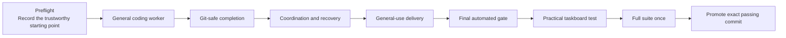
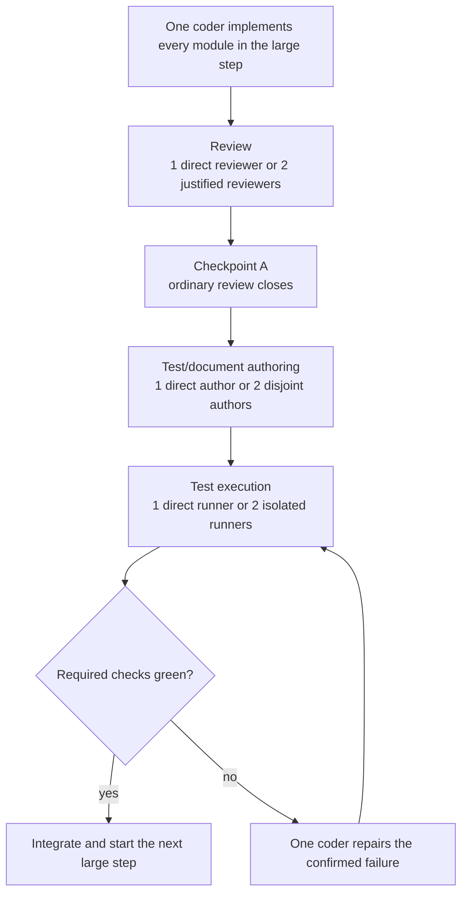
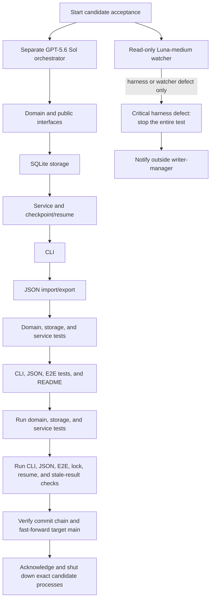

# General Coding Harness: Simple Execution Plan

Status: archived V1 summary; non-operative. The live runner document is
`plans/general-coding-harness/EXECUTION_PLAN_2.md`, with
`active_docs/GENERALIZATION_SPEC_2.md`, `active_docs/IMPLEMENTATION_ROADMAP_2.md`,
`active_docs/EXECUTION_READINESS_2.md`, `goal.md`, `task-card-spec.md`, and `test-cleanup.md`.
Do not dispatch, invalidate, or accept work from this older summary.

This is the historical plain-language guide to the archived V1
[detailed execution plan](../plans/general-coding-harness/EXECUTION_PLAN.md).

## The Important Distinction

The plan has three levels:

1. **Requirements** are the 128 individual things that must remain covered.
2. **Modules** are related implementation components that satisfy groups of requirements.
3. **Large steps** combine multiple modules into one coherent feature or deliverable.

The complete coding, review, test-authoring, and test-execution cycle runs once per **large step**. It does not run once per requirement, file, commit, or module.

## Whole Workflow

The four implementation steps run serially. A later step starts only after the current step is integrated and green.

## Preflight

Preflight changes no product code and receives no full QA cycle. The writer-manager records:

- Frozen and candidate commits, branches, status, and diff.
- Tool versions.
- Separate runtime and output paths.
- Existing green tests.
- The passed-test registry.
- Worker launch and frozen-checkout guardrails.

If preflight fails, implementation does not start.

## The Four Large Steps

### 1. General Coding Worker

**What it delivers:** the harness can start, monitor, stop, fail, and resume an ordinary coding worker without firmware-specific records. The existing firmware worker still follows its own contract.

Modules bundled into this step:

- Passive evaluator default.
- Versioned coding invocation and dispatch.
- Coding-worker lifecycle and resume.
- Firmware dispatch compatibility.

### 2. Git-Safe Completion

**What it delivers:** the harness proves that a worker used the intended repository, worktree, branch, and base commit. It accepts work as merge-ready only when the result is current, committed, and clean.

Modules bundled into this step:

- Git lane identity.
- Merge-ready result validation.
- Invalid-result reporting and correction.

### 3. Coordination And Recovery

**What it delivers:** non-Git resources can be locked safely, and the manager can observe waiting, stale ownership, invalid results, conflicts, recovery, events, and acknowledgements.

Modules bundled into this step:

- Generic exclusive resource locks.
- Coding snapshots and conflict detection.
- Durable events and exact acknowledgement.
- Firmware observation compatibility.

### 4. General-Use Delivery

**What it delivers:** a new user can follow the generic coding documentation and complete a disposable two-worktree coding run from beginning to end.

Modules bundled into this step:

- Generic configuration, examples, and documentation.
- Disposable general-coding integration test.

## What Happens Inside A Large Step

Review failures repeat review after the coder repairs them. Test failures do not reopen ordinary review; only affected tests run again.

Pool size 1 is normal and valid. It is a direct lane with no fake split or merge. Pool size 2 is used only when the work is genuinely independent. Pool size 3 is available but is not needed by this plan.

## Actual Lane Assignments

| Large step | Coding lane | Review lane(s) | Test/document author lane(s) | Test-execution lane(s) |
|---|---|---|---|---|
| General coding worker | One coder implements all four worker modules serially | 1: complete worker boundary | 1: cohesive controller and evaluator tests | 2: coding path; firmware/watcher compatibility |
| Git-safe completion | One coder implements Git identity and result trust serially | 1: complete identity-to-result trust chain | 1: shared Git/result fixture and tests | 2: Git matrix; result matrix |
| Coordination and recovery | One coder implements locks, snapshots, events, and compatibility serially | 2: lock/process safety; event/firmware behavior | 2: lock tests; event/reconciliation tests | 2: contention/recovery; events/firmware |
| General-use delivery | One coder implements docs/config and the integration fixture serially | 1: complete user journey | 2: documentation smoke; integration tests | 2: successful journey; failures/compatibility |

The writer-manager waits for every real parallel lane, combines its results, and makes one decision. Author commits merge one at a time.

## Dependencies

| Large step | Starts after | Why |
|---|---|---|
| General coding worker | Preflight | Establishes the generic worker contract used by everything else |
| Git-safe completion | General coding worker | Git and results attach to a known coding invocation |
| Coordination and recovery | Git-safe completion | Reconciliation consumes final Git and result facts |
| General-use delivery | Coordination and recovery | The integration test proves the stabilized complete path |
| Final automated gate | General-use delivery | Reviews and tests one exact candidate commit |
| Practical acceptance | Final automated gate | Uses the finished candidate as the only active harness |

## Final Automated Gate

The final gate does not repeat all earlier work:

1. One fresh Terra-medium reviewer audits the exact candidate against the specification.
2. One author adds only genuinely missing final tests. A no-gap result is valid.
3. Up to two isolated Luna-high runners execute only tests that are not already green or were invalidated by the latest change.
4. A failure gets one serialized repair and reruns only affected checks.

The complete suite still does not run here. It runs once after practical acceptance.

## Practical Acceptance

The frozen harness is stopped before this test. The outside writer-manager supervises but does not orchestrate the candidate harness.

Only one target worker runs at a time. The outside writer-manager, candidate orchestrator, and watcher occupy the other three agent slots. Each target branch starts from the previously accepted commit, producing a simple descendant chain instead of a conflict-heavy merge tree.

The watcher cannot:

- Message or direct the orchestrator or target workers.
- Edit files.
- Acknowledge events.
- Repair problems.
- Stop the test for an ordinary application or orchestrator mistake.

Bad prompts, malformed results, retries, merge mistakes, and wrong orchestrator bookkeeping are expected. If the harness rejects or records them safely, the orchestrator corrects them and continues. The watcher stops the exact candidate topology only for an actual harness defect or watcher defect, then notifies the outside writer-manager.

## Frozen-Checkout Guardrail

Every subagent runs in full-bypass mode from its assigned candidate, validation, target, watcher, or evidence directory.

- Subagents are explicitly forbidden from inspecting `pre-conversion-rollback`.
- Only the writer-manager can deliberately access the rollback checkout.
- The writer-manager records rollback `HEAD`, status, and diff before and after every wave.
- Any rollback change rejects the wave and stops new launches.

This is a soft guardrail, not a hard filesystem sandbox.

## What This Plan Deliberately Avoids

- No QA cycle for each requirement or module.
- No automatic three-worker fan-out.
- No parallel production coding.
- No scheduler, task database, parsed dependency graph, or broad adapter framework.
- No unnecessary firmware redesign.
- No repeated execution of tests already green for unchanged behavior.
- No repair inside a still-running failed acceptance topology.

## Completion

Promotion happens only after:

1. All four large steps pass.
2. The final focused gate passes.
3. The candidate builds and tests the taskboard project successfully.
4. The watcher reports no unresolved critical harness defect.
5. Candidate processes shut down cleanly.
6. `verify.py --full` passes once on the exact final candidate.

Physical firmware acceptance is required only for a public firmware-supporting release or after hardware-specific changes.

## Related Documents

- [Generalization specification](GENERALIZATION_SPEC.md)
- [Implementation roadmap](IMPLEMENTATION_ROADMAP.md)
- [Detailed execution plan](../plans/general-coding-harness/EXECUTION_PLAN.md)
